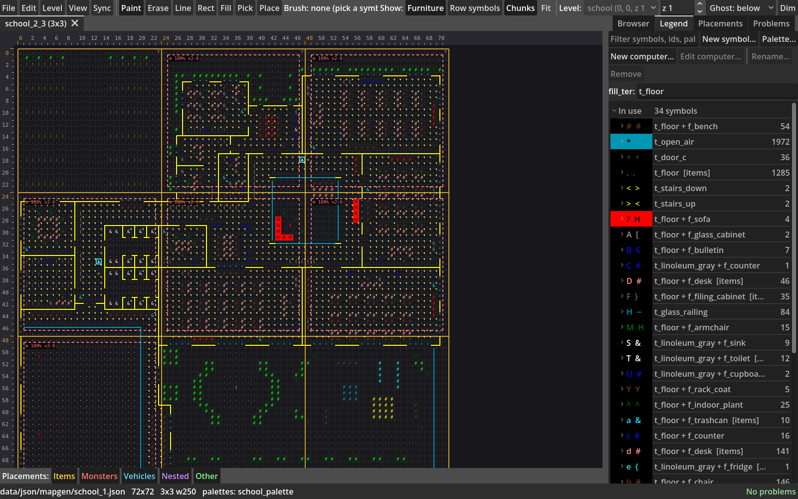
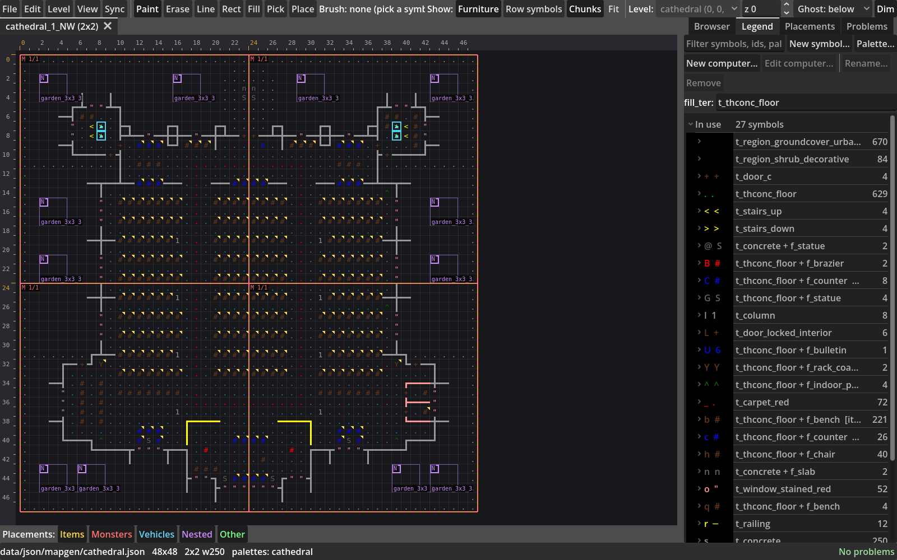
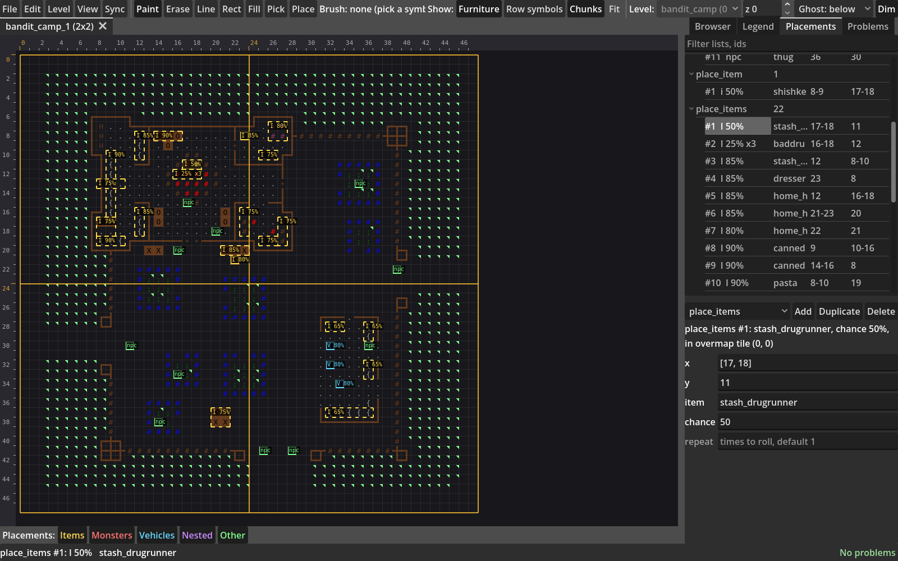
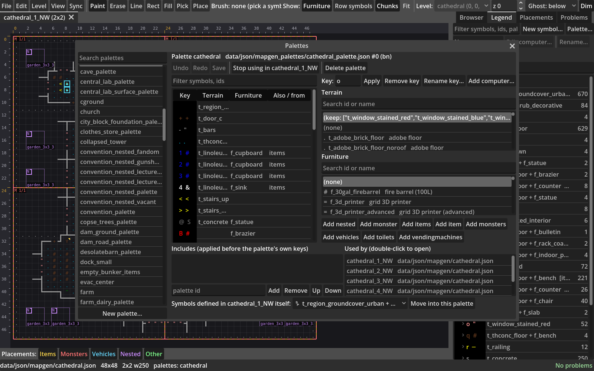

# BN Map Editor

A map editor for [Cataclysm: Bright Nights](https://github.com/cataclysmbnteam/Cataclysm-BN) JSON
mapgen, built with Godot 4.7. It opens the maps, palettes and buildings in a BN checkout, lets you
edit them as ASCII, checks them the way BN would on load, and saves files formatted exactly as BN's
`json_formatter` would (a built-in port of it, so no BN tools are needed).



## Features

- **Maps**: open any `om_terrain`, nested chunk or multi-tile mapgen. Paint, erase, line, rect,
  fill and pick tools, with undo/redo. Nested chunks are drawn over the map where BN would place them.
- **Legend**: every symbol a map uses, what it resolves to (terrain, furniture, items, ...) and
  which palette it comes from. Add, rename and remove symbols, or set `fill_ter`.
- **Placements**: `place_items`, `place_loot`, `place_monsters`, `place_vehicles`, `place_nested`
  and the rest are drawn on the map and can be selected, moved, resized and edited as fields.
- **Palettes**: edit a palette's keys and includes, and see which maps an edit would change before
  you make it.
- **Buildings**: step between a building's z-levels, see the level above or below as a ghost, add
  new floors and roofs, and create new buildings with their overmap entries.
- **Validation**: a Problems panel reports what BN would complain about, including stairs that
  don't line up between levels, elevators whose other floors BN won't offer, and computer consoles
  that can't reach their doors.
- **Workspace and sync**: edits are saved to a workspace folder, never into BN directly. The Sync
  window compares the workspace with BN and pushes changes when you're ready.
- **MCP server**: the same editing operations are available to AI assistants over MCP (see below).

| Legend | Placements |
| --- | --- |
|  |  |



## Installing

Download the latest build from the
[Releases page](https://github.com/naj19746/bn-map-editor/releases) and run it. On first launch,
choose your Cataclysm-BN folder (any checkout or install with `data/json`); it can be changed later
under File > Open BN folder.

## MCP server

The editor can also run as a stdio MCP server, so an AI assistant can work on maps the way you do in
the editor:

- **Read**: search maps, get a map's rows, legend, placements and an ASCII view, look up palettes,
  ids, mods and buildings.
- **Edit**: paint cells, lines, rectangles and fills; add, rename and remove symbols; add, change
  and remove placements; create new maps, building levels and buildings; edit palettes (with a dry
  run showing every map an edit would change). Every edit is one undo step.
- **Validate**: the same findings as the Problems panel, for a map, a palette or a whole building.

Edits stay in memory until the assistant saves, and saves go to your workspace only, never into
BN. You review them and push them into BN from the editor's Sync window, as with your own edits.

Start the downloaded build with `--headless --mcp`. To register it with Claude Code:

```sh
# Linux
claude mcp add bn-map-editor -- /abs/path/to/bn_map_editor.x86_64 --headless --mcp
# Windows: use the .console.exe next to the .exe, which keeps stdin/stdout attached
claude mcp add bn-map-editor -- C:\path\to\bn_map_editor.console.exe --headless --mcp
```

> **TODO:** the MCP server is untested on Windows. The `.console.exe` route above is the expected
> way to run it, but it hasn't been tried yet; reports welcome.

Other MCP clients take the same command and arguments, e.g. in a JSON config:

```json
{"mcpServers": {"bn-map-editor": {"command": "/abs/path/to/bn_map_editor.x86_64", "args": ["--headless", "--mcp"]}}}
```

The server uses the editor's saved BN folder, mods and workspace, so open the editor once first, or
pass `--bn <path>`, `--workspace <path>` and `--mods <id,id>` after `--mcp`. It reads them when it
starts: after changing the BN folder or mods in the editor, restart the server (in Claude Code,
reconnect it from `/mcp`). The editor and the server can share a workspace; each notices the
other's saves.

From source, register `tools/mcp_server.sh` instead (it takes the same flags):

```sh
claude mcp add bn-map-editor -- /abs/path/to/bn_map_editor/tools/mcp_server.sh
```

## Development

Running from source needs [Godot 4.7](https://godotengine.org/download) and a BN checkout (by
default `../Cataclysm-BN`, or set `BN_PATH`):

```sh
godot --path .                            # run the editor
godot --path . -- --open fire_station     # ...opening a map at startup
tools/run_tests.sh [FILTER]               # tests, headless
```

See `CLAUDE.md` for the code layout and project rules, and `PLAN.MD` for the design and roadmap.

## License

MIT, see [LICENSE](LICENSE).
